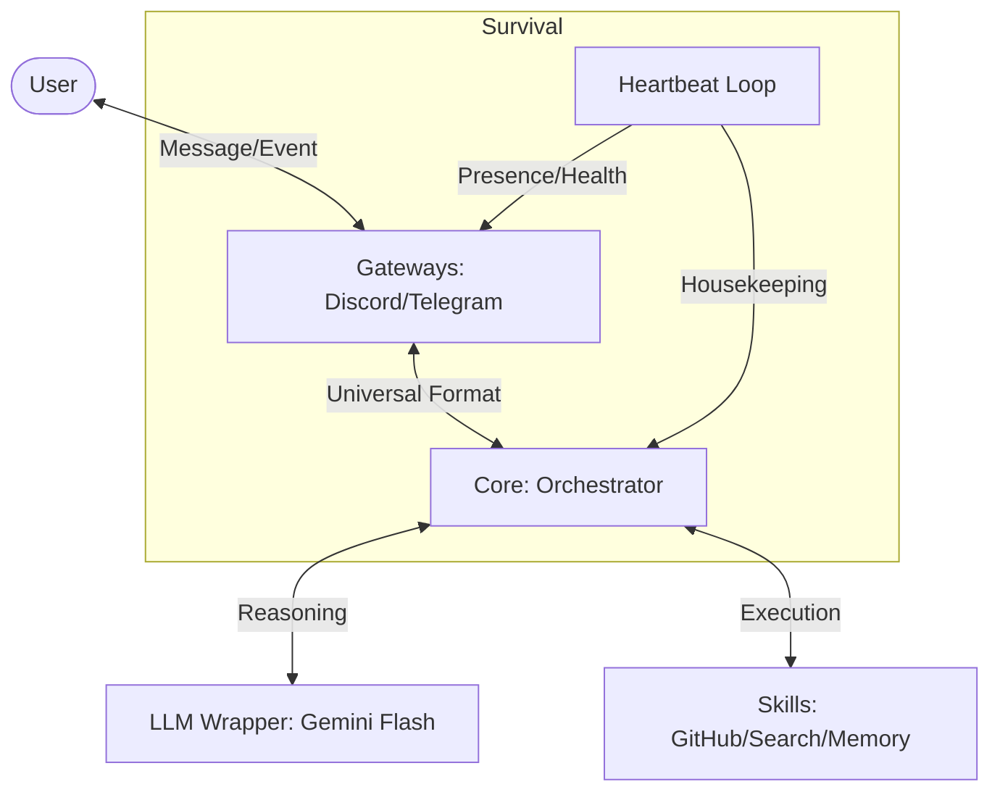

# Mini-Miles 🌟

A lightweight, API-efficient, and modular rewrite of the Miles Orchestrator. 

## 🏗️ Architecture

Mini-Miles is built on a **Modular Gateway-Skill** architecture. It prioritizes low-latency response and minimal token usage by using a single high-context Master Agent instead of a multi-agent hierarchy.

### System Diagram

## 📁 Project Structure

- **`core/`**: The central logic.
    - `orchestrator.js`: Manages message flow and tool loading.
    - `heartbeat.js`: Central loop for periodic tasks and health checks.
- **`gateways/`**: I/O adapters for different platforms.
    - `discord.js`: Self-bot gateway implementation.
    - `telegram.js`: Telegram adapter skeleton.
- **`skills/`**: Atomic capabilities loaded as tools.
    - `github.js`: GitHub repository and file operations.
    - `search.js`: Web searching and scraping.
    - `memory.js`: Interface for persistent memory (Sheets/JSON).
- **`utils/`**: Shared helpers.
    - `llm.js`: High-efficiency wrapper for Gemini API.
    - `logger.js`: Unified logging system.
- **`index.js`**: Main entry point.

## 🚀 Design Principles

1. **Lightweight**: Minimal dependencies and non-blocking I/O.
2. **API Efficient**: 
    - Pruned conversation history.
    - System prompt optimized for instruction following.
    - Single-pass tool calling (avoiding nested agent hops).
3. **Resilient**: The **Heartbeat** ensures the bot remains logged in and performs background tasks even without user input.
4. **Platform Agnostic**: Orchestrator speaks "Universal Event", making it easy to add new gateways.
